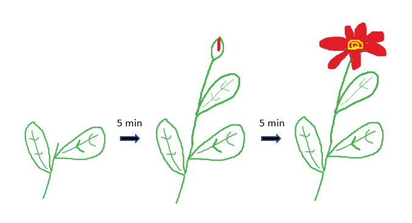

# Superfluid

<button>Go To Discord</button>

## About Superfluid

Superfluid is a smart contract framework on L1 Ethereum, enabling you to move assets on-chain following predefined rules called agreements. With a single on-chain tx, the money will flow from your balance to the receiver in real time! No other tx required works like magic ✨

## Handy Links

\*\*\*\*[**Website**](https://www.superfluid.finance/)\*\*\*\*

\*\*\*\*[**GitHub**](https://github.com/superfluid-finance)\*\*\*\*

\*\*\*\*[**Discord**](https://discord.gg/qPg6Y3d)\*\*\*\*

\*\*\*\*[**Medium blogs**](https://medium.com/superfluid-blog)\*\*\*\*

You may want to check out our ****[**help page**](http://help.superfluid.finance/)\*\*\*\*

Feel free to reach out to our team at **support@superfluid.finance**

## Superfluid Contributor & Community Code of Conduct

**Contributor & Community Code of Conduct**

As contributors and maintainers of this project, and in the interest of fostering an open and welcoming community, we pledge to respect all people who contribute through reporting issues, posting feature requests, updating documentation, submitting pull requests or patches, and other activities.

We are committed to making participation in this project a harassment-free experience for everyone, regardless of level of experience, gender, gender identity and expression, sexual orientation, disability, personal appearance, body size, race, ethnicity, language proficiency, age, religion, or nationality.

Examples of unacceptable behaviour by participants include:

* The use of sexualised language or imagery
* Personal attacks
* Trolling or insulting/derogatory comments
* Public or private harassment
* Publishing other's private information, such as physical or electronic addresses, without explicit permission
* Fraudulent or deceitful conduct

Project maintainers have the right and responsibility to remove, edit, or reject comments, commits, code, wiki edits, issues, and other contributions that are not aligned to this Code of Conduct, or to ban temporarily or permanently any contributor for other behaviours that they deem inappropriate, threatening, offensive, or harmful.

By adopting this Code of Conduct, project maintainers commit themselves to fairly and consistently applying these principles to every aspect of managing this project. Project maintainers who do not follow or enforce the Code of Conduct may be permanently removed from the project team.

This Code of Conduct applies both within project spaces and in public spaces when an individual is representing the project or its community.

Instances of abusive, harassing, or otherwise unacceptable behaviour may be reported by contacting a project maintainer at [support@superfluid.finance](mailto:support@superfluid.finance) All complaints will be reviewed and investigated and will result in a response that is deemed necessary and appropriate to the circumstances. Maintainers are obligated to maintain confidentiality with regard to the reporter of an incident.

This Code of Conduct is adapted from the [Contributor Covenant](http://contributor-covenant.org/),[ version 1.3.0](http://contributor-covenant.org/version/1/3/0/).

