# Flow NFTs

## What are Flow NFTs

You can think of Flow NFTs as on-chain labels of the sender and receiver of a certain stream. They enhance the visibility of streams on-chain.&#x20;

Flow NFTs are non-transferrable ERC721 tokens that are minted when a stream is opened and burned when closed.

## Purpose of Flow NFTs

1. Provide a visual representation of streams for display - akin to how [Uniswap v3 NFTs](https://opensea.io/collection/uniswap-v3-positions) allow you to view your LP positions on NFT market place galleries.
2. Allow for easy viewing of sender and receiver pertaining to stream creation/deletion transactions via block explorer and through minting/burning events - [for example](https://mumbai.polygonscan.com/tx/0x7e3454ea43c762d049590aac6cdb792b70b84a33d9d2a154f3e6535d174ba986).

## Flow NFT Dynamics

<figure><figcaption></figcaption></figure>

#### **Opening a stream**

When a stream is started between two accounts, the Superfluid Protocol mints both the sender and receiver an NFT. The sender gets an _Outflow NFT_ and the receiver gets an _Inflow NFT_.

#### **Closing a stream**

When a stream is cancelled, both the sender and receiver's Flow NFTs are burned.

#### **Transferring Flow NFTs**

Flow NFTs are non-transferrable.


#### Each Super Token has its own distinct Inflow and Outflow NFT contracts.&#x20;

For instance, if a fUSDCx stream is started to you and then a fDAIx stream is started to you on Mumbai testnet, the Inflow NFTs you receive will originate from separate contracts. The fUSDCx Inflow NFT address is [here](https://mumbai.polygonscan.com/address/0x92db74808afbd8f6e90ec476fa78b2ac99cca4bc#readContract) while the fDAIx address is [here](https://mumbai.polygonscan.com/token/0xda1b6d12b2a17c1a64211dab7224973fdacbb4fb). They are not the same contract!


## Example Transaction

See the minting of Flow NFTs in action in this create-flow transaction.

Stream Sender: `0xbbf19110bf3c536b608877f1e02fdbd3cfac65a6`

Stream Receiver: `0xc41876dab61de145093b6aa87417326b24ae4ecd`



As you can see, through minting of the Flow NFTs, you can view on-chain who is sending and receiving the streams involved in a transaction.

## Flow NFT Visuals

The Flow NFT visuals will always show:

1. Monthly Flow Rate
2. Super Token being streamed
3. Sender & Receiver

<div>

<figure><figcaption><p>Example <strong>Inflow</strong> NFT for an account being streamed TDLx</p></figcaption></figure>

 

<figure><figcaption><p>Example <strong>Outflow</strong> NFT for an account being streamed TDLx</p></figcaption></figure>

</div>

## Useful Functions

#### Super Token Functions

Super Tokens hold two public immutable variables containing the Inflow and Outflow NFT addresses

<pre><code><strong>address outflowNFT = superToken.CONSTANT_OUTFLOW_NFT();
</strong>
address inflowNFT = superToken.CONSTANT_INFLOW_NFT();
</code></pre>

#### Flow NFT Functions

Flow NFTs are ERC721s. On top of the ERC721 interface, these read functions they provide allow you to work with the stream data pertaining to the Flow NFTs.&#x20;

```
struct FlowNFTData {
    address superToken;
    address flowSender;
    address flowReceiver;
    uint32 flowStartDate;
}

// Get stream data from a Flow NFT token ID
function flowDataByTokenId(
    uint256 tokenId
) external view returns (FlowNFTData memory flowData);

// Get Flow NFT token ID given some stream data
function getTokenId(
    address superToken,
    address flowSender,
    address flowReceiver
) external view returns (uint256);
```
