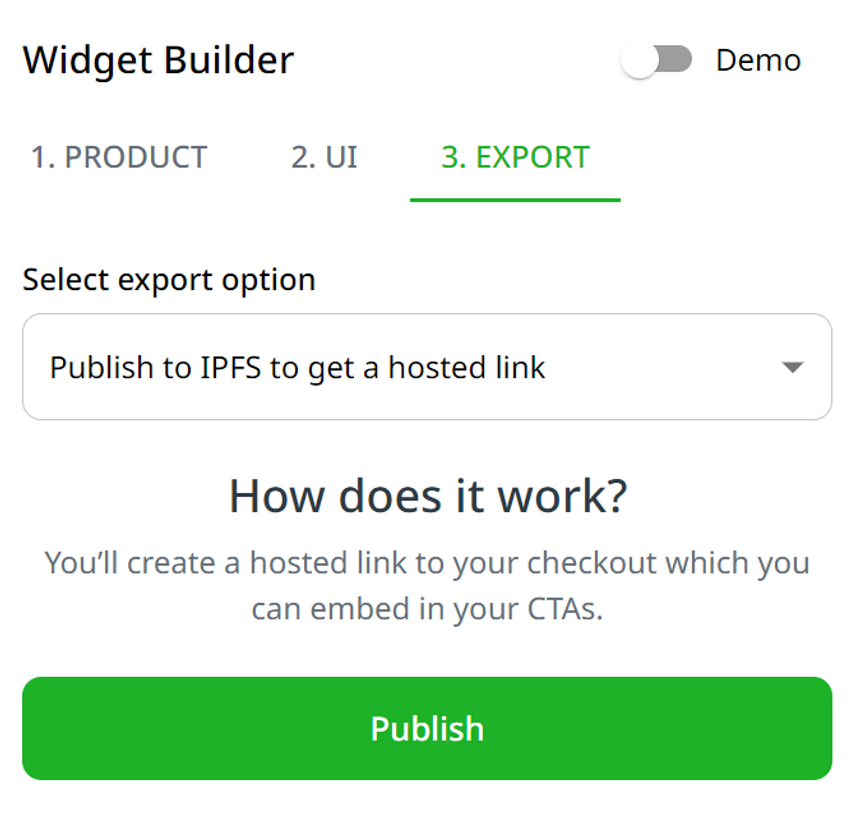
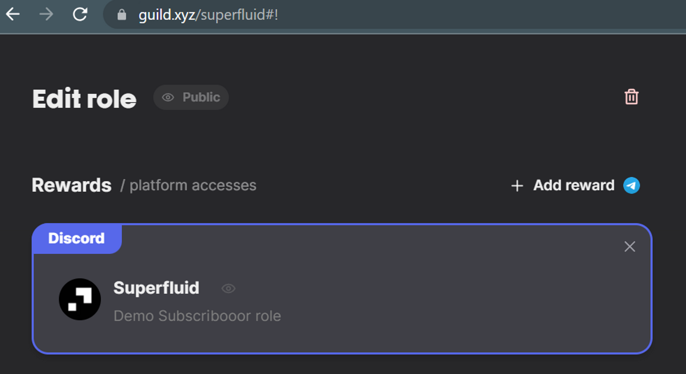

# Gating with Superfluid Subscriptions & Guild.xyz

This guide will thoroughly explain how to utilize Superfluid Subscriptions with Guild.xyz. Using the two, you can control access through Guild based on the existence of a Superfluid subscription stream to a desired receiving address.

#### Quick Links

[Checkout Builder](https://checkout-builder.superfluid.finance/) | [Console](https://console.superfluid.finance/matic/protocol) | [Flow Rate Converter](https://hz89i.csb.app/) | [Dashboard](https://app.superfluid.finance/) | [Guild.xyz](https://guild.xyz/)

## 1. Create Your Subscription Payment Widget

1. Head to the [Checkout Builder](https://checkout-builder.superfluid.finance/)
2. Delete the initial payment option set in **Payment Details Summary** at the bottom of the Product section.

<figure><figcaption></figcaption></figure>

3. Begin customizing your widget payment info on **Product** and aesthetic on **UI**
4. On **Export**, one-click deploy to IPFS and get the payment URL (or save the JSON for later if you want to embed in your site directly)

<figure><figcaption></figcaption></figure>

## 2. Collect your Addresses

1. Copy down the CFAv1 Address for your intended network of choice from the [Console](https://console.superfluid.finance/matic/protocol)

<figure><figcaption></figcaption></figure>

2. Copy down the address of the Super Token you're seeking payment in from the [Console](https://console.superfluid.finance/matic/protocol). You can look through the list or search the token symbol on the search bar at the top of the page.

## 3. Get Wei/Sec Flow Rate

Head to our [Flow Rate Calculator](https://8h8ksz.csb.app/) to convert the monthly rate you elected for your Checkout Widget Payment Option into a wei/sec rate. Copy it down.

## 4. Create Your Guild Gate

1. Head to [Guild.xyz](https://guild.xyz/create-guild), select what you're looking to gate, and create a role.

<figure><figcaption>
Just an example of what it could look like after set up
</figcaption></figure>

2. Select the requirement as "Contract query"

<figure><figcaption></figcaption></figure>

2. Select the intended network and put in the CFAv1 address copied down from earlier as the Contract Address

<figure><figcaption></figcaption></figure>

3. In the Method dropdown, select the `getFlow` method

<figure><figcaption></figcaption></figure>

4. Input the following:

* `receiver` - the address to receive the subscription payments (same receiver you set in Payment Options on the Checkout Widget)
* `token` - the address of the Super Token you're accepting payment in (which you copied down earlier)
* `sender` - leave the sender address as USER\_ADDRESS

<figure><figcaption></figcaption></figure>

5. Select flowRate in the final drop down and make the qualifier `>=`

<figure><figcaption></figcaption></figure>

6. Input the wei/sec flow rate that you copied down earlier

<figure><figcaption></figcaption></figure>

## Start Using! :checkered\_flag:

Share your Checkout Widget with anyone - people who subscribe with it will be able to access the whatever it is you have gated with Guild.xyz.

**Additional Considerations:**

* You can layer on access levels and pricing tiers by adding payment options to your widget and configuring various roles.
