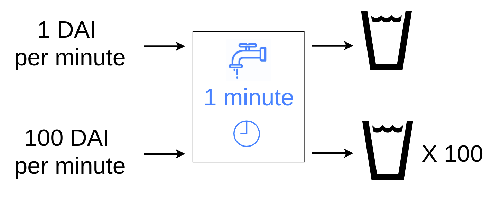

# 🥤Soda Machine

In this example app, we will create a machine for purchasing soda in real-time. The soda will only flow while we are paying, so we'll be in charge of how much we want in our cup!

## $1 DAI = 1 SODA

To make things simple, we'll sell our SODA for $1 DAI

However, instead of discrete payments, like handing a single dollar bill to a cashier, the machine will only dispense _while we are actively paying_. This means if we stream DAI to the machine in real-time, it will start dispensing soda. And if we turn off our DAI stream, the SODA will stop flowing as well.

## Operating the machine

When we deploy the contract, we automatically mint 1M SODA tokens. This should be enough for many happy customers. We also set the **accepted token** we wish to earn, which in this case is DAIx \(Superfluid DAI\). 

To start receiving soda, a customer just needs to start flowing DAIx to the Soda Machine contract address, which can be done using the [Superfluid Dashboard](https://app.superfluid.finance/). Once they've received the desired amount, they can cancel their DAIx stream.

## Prerequisites

Before starting this tutorial you should: 

* Have some goerli ETH and tokens in your wallet from the dashboard [https://app.superfluid.finance](https://app.superfluid.finance)

## Setup

Click the link to load the contracts in Remix:

## Callbacks

Since our Soda Machine needs to automatically react to incoming DAIx streams, we'll use Super App Callbacks. The Callbacks is where we'll check the incoming token stream, and start flowing SODA tokens back to the customer.

