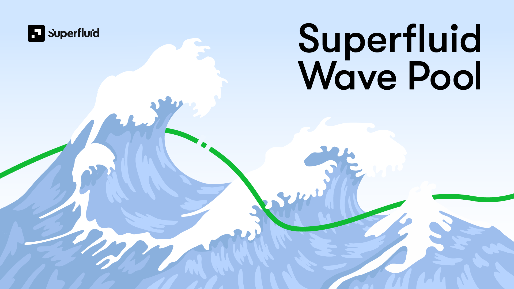

# 🌊 Superfluid Wave Pool

## General Info

<mark style="color:green;">What's the Wave Pool?</mark>

The Wave Pool is a "continuous hackathon" that repeats every month. During the month, community members may submit Superfluid-related work to each Wave and be put in the running for the Wave's prizes (like a hackathon!).

However, unlike a hackathon, the Wave Pool is **not just for technical work**! Non-technical work such as articles, videos, documentation, and tutorials are all considered and encouraged for submission.

&#x20;The Wave Pool is somewhat like a fill-in-the-blank bounty program that aims to reward the wide variety of work that Superfluid community members complete without us explicitly targeting those work items with bounties. Let's reward and recognize good work when we see it!

**Each Wave is numbered** - The first Wave starting on September 1st, 2022 is Wave #1, the one for October will be Wave #2 and so on.

**Waves last over each month** - For example, Wave #1 will span from September 1st to September 30th. Right after one finishes, the next one starts!

**Start or Submit **_**ANYTIME**_ - Wave Projects can be started or submitted at _any time_. The only limitation is that you can't submit old work from a previous month. So for example, a project you finished 3 months ago wouldn't be eligible for this month's Wave.

<mark style="color:green;">Why the Wave Pool?</mark>

As a dev or creator, the Wave Pool is your chance to take our tech, build something really cool with it, and then have a submission to show and demonstrate as a testament to your skills. Competing in the Wave Pool is <mark style="color:green;">an opportunity to further your career as a developer and earn distinguishment!</mark>

Prize winner or not, you'll be given exposure to the Superfluid team and community. Our ecosystem and network is an asset for anyone aspiring to develop a career in the Web3 space. From the growing number of start ups leveraging real-time finance to the increasing value of knowing how to build with Superfluid, a strong Wave Pool submission will give your resume a boost.

## Current Prizes

The top three submissions to the May Wave will earn one of the below prizes 🥇

**1st Place** - $2,000

**2nd Place** - $1,500

**3rd Place** - $1,000

**Co-Sponsor Prize** - Best Projects Using Superfluid with [Gelato](http://localhost:5000/s/MYhu8kEOiGEJPzxtx8NL/) :icecream:

&#x20;    **1st Place** - $1,500&#x20;

&#x20;    **Pool Prize** - $1,000

**Pool Prize** - $1,000 (split among hackers who did great work, but didn’t quite make the Top 3 cut)

&#x20;   We may refer to Pool Prize winners as "Honorable Mentions" in announcement material!

_Notice: Wave Pool payouts are subject to KYC screening as per_ [_international sanctions laws_](bounty-program.md#note-bounty-hunters-must-adhere-to-the-following-statement)_._

## Get Started 🙋‍♀️

#### **1. First, understand what kind of work is acceptable 👇**

<mark style="color:green;"><strong>Guidelines for Acceptable Work</strong></mark>

**1. Pertains to Superfluid, doesn't just use Superfluid as a side element**

**2. Open source and/or shareable**

**3. Completed during the Wave**

Say you complete an article during Wave #1 in September but want to submit it to Wave #2 in October - that work won't be accepted.

**4. In a state of “itemized completion”**

Your submission should be a consolidated deliverable/feature that can work as intended and can be demonstrated.

**5. Good quality**

“Good quality” is rather subjective. We know it when we see it and we will develop precedence with each Wave. As we approach the submission deadline, if there are not enough quality submissions, we would rather not reward a prize than to issue one a scrappy submission.

**6. Presentable**

An article or video is already presentable, but if you're submitting code, make sure it's documented (with a README or something) or submit it with a video explainer!

**7. New Work**

Previous Superfluid-sponsored hackathon projects or bounty submissions won't count unless you're submitting additional itemized progress after the hackathon or on the bounty.

**8. Independent Hackers Only**

If the work you're submitting is on behalf of a larger formal organization (in particular profit-seeking companies, DAO, etc.) we may reduce consideration.

**Note:** If you complete multiple projects in the same month, it's okay to submit them in the same month. We'll consider the sum of your work when judging for prizes.

<mark style="color:green;">Examples of Acceptable and Unacceptable Work</mark>

**Acceptable Examples**

* Integrating Superfluid with an existing protocol ([Instadapp integration example](https://github.com/Instadapp/dsa-connectors/pull/244))
* A completed and published article on Superfluid concepts ([Donoso example](https://medium.com/@javier\_donoso/superfluid-gelato-for-stream-scheduling-7c32ed975f04))
* A completed and well documented example showing Superfluid integrated with Lens Protocol ([Wary Lens PR example](https://github.com/aave/lens-protocol/pull/101))
* A detailed and completed written specification showing how to create tradeable tokenized salaries ([NIFLOT example](https://www.notion.so/2db13f22833149ffa7d03e0f1de71af6))
* Improvement to one of our Docs pages or sections (propose your fixes, inquire for a Editor invite link in the bounties channel, and we’ll set you up!)
* A video explainer on Superfluid or Superfluid dev concepts ([Fugu example](https://youtu.be/L2364bmZA5o))
* A new completed stream management UI feature for a Superfluid-powered project ([Ricochet example](https://github.com/Ricochet-Exchange/ricochet-frontend/issues/97))

**Unacceptable Example**

* A completed project that only discusses how it will use Superfluid and does not implement anything
* A partially completed article
* An itemized completion that does not pertain to Superfluid but is for a Superfluid-related project
  * Ex: You make a CI/CD pipeline for your Superfluid-powered lending protocol
* A project that does not achieve its stated purpose (Ex: I say I will make a tradeable NFT cashflow project, but my contract does not succeed in editing the flow upon transfer of the NFT)


If after reading this, you're unsure if your work is acceptable - ask us in our Discord or **just go for it**! There's nothing to lose and we can always be flexible.


#### **2. Come up with an idea**&#x20;

Here is an assortment of different ideas for things to tackle as your Wave Project:



We suggest you drop your idea in the [#🌊wave-pool](https://discord.com/channels/752490247643725875/1017102296372478052) channel in our Discord so we can give some thoughts and feedback. We could also open a thread for support as you begin navigating your work!

#### **3. Start working on it**


If you _finished_ the work several months ago, then you can't wait and submit it to the current Wave. It's old work! We want to see newly completed work ✨\
\
When you _start_ the work doesn't matter. You could have been working on something for several months and it will still be eligible for submission to the current Wave as long as you've newly completed it.


#### **4. Make a Devfolio page (if your project is technical)**

Sign up for Devfolio [here](https://devfolio.co/) and then fill out your project details [here](https://devfolio.co/projects).

* Here's an [example ](https://devfolio.co/projects/test-a7d3)of a solid Devfolio project page

_**Please include a video demo**_ - it's better for showcasing your project and helping us judge.

* Keep it under 5 minutes
* Make sure to cover high level usage of your project and the technical elements that used Superfluid (so yes, feel free to dig into the code!).
* We're _not_ expecting this to be super tidy - just a rough unscripted walk-through is fine regardless the length

#### **5. Submit your work before month end**

If you worked together on a team on your Wave Project, just submit once for the whole team

_Submissions are due on the last day of the month at 11:59pm PST._

Submit your Wave Project to the Wave Pool Submission Form 👇



#### **6. Winners are announced**&#x20;

If you have a winning submission, in the days after the Wave completes, we will DM you with details on how to claim your prize along with a POAP to commemorate your accomplishment!&#x20;

<figure><figcaption></figcaption></figure>

We will also announce winners publicly in our Discord and highlight interesting submissions on our socials or during Community Calls.
