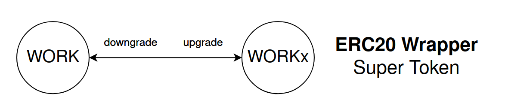

# $WORK Super Token

The WORK token is an **ERC20 Wrapper Super Token**. This means there is an underlying ERC20 token, which is called "WORK". The WORK token is wrapped  __or "upgraded" to enable Super Token features like streaming, batch calls, and Super App capabilities. 

The ERC20 wrapper contract works similarly to most token wrappers. When WORK tokens are sent to the contract using the **upgrade** function, new WORKx tokens are minted for the sender. To get back to the underlying token, the **downgrade** burns the WORKx and returns the original WORK.

### Do I need to upgrade/downgrade my WORK?

Probably not. Super Tokens are fully ERC20 and ERC777 compatible, so it should work in any ERC20-compatible defi protocol \(most of them are\). However, defi is innovating at a very rapid pace, so there's no way we can test every single new lending/staking/farming protocol released. If you're unsure, feel free to ask us in the [Discord](http://discord.superfluid.finance) for help. Or better yet, be a pioneer and "test on mainnet", then let the community know what you find!

👯 General rule of thumb here is stick to the Super Token WORKx. **There's no need to have multiple pairs for the same token \(WORK,WORKx\) on every marketplace**. This just makes things more confusing for everyone.

### Do all Super Tokens work this way?

The other main type of Super Token is called a Custom Super Token. These do not have an underlying asset, and therefore cannot be upgraded or downgraded. They are deployed as Super Tokens right from the start. The advantage of Custom Super Tokens is the ability to add custom logic, which is not possible with ERC20 Wrapper Super Tokens such as WORK.

### Show me the contracts!

Most Super Tokens rely on a shared logic contract using the EIP-1822 and EIP-1967 proxy pattern. The logic contract for WORK can be found here: [SuperToken.sol](https://github.com/superfluid-finance/protocol-monorepo/blob/dev/packages/ethereum-contracts/contracts/superfluid/SuperToken.sol) and it's address on xDAI chain is 

When ERC20 Wrapper Super Tokens are deployed, the Super Token Factory is used to initialize the proxy with the Super Token logic. The factory can be found here: [SuperTokenFactory.sol](https://github.com/superfluid-finance/protocol-monorepo/blob/dev/packages/ethereum-contracts/contracts/superfluid/SuperTokenFactory.sol) and it's address on xDAI chain is 0x23410e2659380784498509698ed70E414D384880

See [🔗 Network Directory](../networks/networks.md) for all deployed contract addresses

### Why was ERC20 Wrapper Super Token picked for WORK?

One of the reasons for selecting this type was to ensure cross-chain compatibility. By first deploying an ERC20 to Ethereum mainnet \(Chain ID 1, "homestead"\), the developers can be confident that there will always be a token bridge to other blockchains, even those which haven't been created yet. 

At the time of WORK launch, Superfluid was not deployed on Ethereum mainnet. Therefore the WORK ERC20 was deployed on mainnet, bridged to xDAI and then upgraded to become a Super Token.

### Resources

For more details check out the documentation for [Super Tokens](../docs/super-tokens.md)

